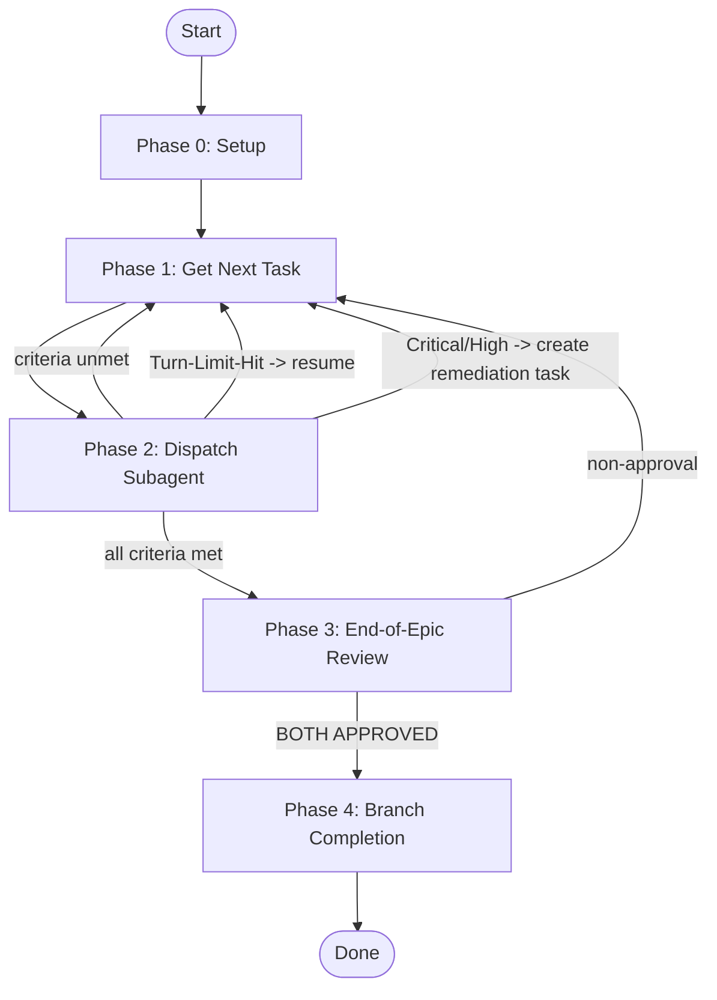

<!-- Generated from skills/execute-ralph/SKILL.md -->



<skill_overview>
Execute a complete epic autonomously by dispatching one Agent subagent per task. **Platform routing:** If running in Claude Code (you see "You are Claude Code" in your system prompt), stop now and load the `execute-ralph-cc` skill instead -- it uses ScheduleWakeup for reliable autonomous looping in Claude Code. Continue with this skill only on other platforms (OpenCode, Gemini CLI, Kimi). Each subagent handles SRE refinement, TDD, test-runner, commit, and task closure in its own context. The main loop only tracks git log progress and epic criteria. End-of-epic: 3 specialized reviews (review-quality, security-scanner, test-effectiveness-analyst) in parallel, then dual final gate (autonomous-reviewer + review-implementation). Branch completion via finishing-a-development-branch.
</skill_overview>

<rigidity_level>
STRICT - Follow the four-phase loop exactly. Epic requirements are immutable. Never ask the user for confirmation.
</rigidity_level>

<quick_reference>

| Phase | Action | Outcome |
|-------|--------|---------|
| **0. Setup** | Triage, load epic, create branch, extract criteria | Ready |
| **1. Get Task** | Claim ready / resume in-progress / auto-create | Task identified |
| **2. Dispatch Subagent** | Agent tool runs task end-to-end, main checks git log | Task done or retried |
| **3. End-of-Epic Review** | 3 specialized reviews + final gate (both must APPROVED) | Epic validated or remediation |
| **4. Branch Completion** | finishing-a-development-branch | Epic closed |

</quick_reference>

## Ralph Autopilot Stop Contract

The leading sentinel control block is the first consecutive non-empty group of sentinel-only lines in the response. Required shapes:

- Non-terminal responses: first non-empty line is exactly `RALPH AUTOPILOT ACTIVE`, followed by enough objective state to resume without asking the user:
  - Current phase
  - Current epic/task id
  - Current success criterion or blocker being handled
  - Next tool call planned
- Terminal responses: first non-empty line is exactly `RALPH AUTOPILOT COMPLETE` or `RALPH AUTOPILOT BLOCKED`; terminal responses must not include `RALPH AUTOPILOT ACTIVE`.

Use `RALPH AUTOPILOT COMPLETE` when the branch is complete and handoff is ready. Use `RALPH AUTOPILOT BLOCKED` when a critical blocker must reach the user.

Active sentinel text alone is not enough to trigger blocking. A Claude Code `UserPromptExpansion` for `/xpowers:execute-ralph` must first activate guarded stop-state for the current runtime session.

The guard only treats sentinels in the leading sentinel control block as control markers. Later quoted examples, logs, or code blocks are ignored.

For defensive compatibility, terminal sentinels still win if they appear in a malformed leading sentinel control block with `RALPH AUTOPILOT ACTIVE`, so stale active markers cannot trap the session.

The Claude Code Stop/SubagentStop guard can resume Ralph only when the exact active sentinel appears as the first non-empty line in an activated execute-ralph session. It does not bypass Claude Code permission prompts or session permission-mode settings. When a permission prompt appears, comply with Claude Code's permission flow; do not claim that Ralph can override it.

<when_to_use>

**Use when:** Epic is well-defined, user trusts autonomous execution, tasks are implementation work.
**Do NOT use when:** Ambiguous requirements (use execute-plans), needs human oversight per task, exploratory work.

</when_to_use>

<the_process>

**CRITICAL: TUI Dashboard Updates (If Supported)**
If the `update_ralph_state` tool is available in your environment, you MUST continually use it to keep the live TUI dashboard updated:
- Call it immediately upon entering a new Phase.
- Call it when claiming or creating a task.
- Call it before dispatching a subagent (set status to "running") and after it returns.
- Provide the `logMessage` field frequently to narrate your progress.
- When all phases are done, call it once with `phase: "done"`.

If the tool is NOT available (e.g. running in Claude Code or OpenCode without the Pi extension), ignore this requirement and proceed with standard terminal logs.

## Phase 0: Setup

```bash
bv --robot-triage || (tm ready && tm list)
```
**Health gate:** If dependency cycles or zero actionable items, alert user and stop.

```bash
bv --robot-next || tm show bd-EPIC
```

```bash
BRANCH_NAME=$(echo "[epic-title]" | tr '[:upper:]' '[:lower:]' | tr ' ' '-' | tr -cd 'a-z0-9-')
git checkout -b "feature/${BRANCH_NAME}"
```

Extract from epic: success criteria (immutable), anti-patterns (forbidden). Store in memory for loop.

---

## Phase 1: Get Next Task (loop entry)

```bash
bv --robot-next                      # Automated triage
```

**A) In-progress task exists** -- resume it (proceed to Phase 2).
**B) Ready task exists** -- claim it: `tm update bd-N --status in_progress`.
**C) If no ready or in-progress tasks exist and epic success criteria are still unmet** -- do not stop - create and execute the next task.

**Refinement Step**:
After task selection/creation, run SRE refinement to ensure the task design is robust:
`Use Skill tool: xpowers:sre-task-refinement (prefer Opus 4.1 model)`

### Auto-create next task from unmet criterion

```bash
tm create "Task: [criterion gap]" --type feature --priority 1 \
  --design "## Goal\n[Close unmet criterion]\n## Success Criteria\n- [ ] Gap closed"
tm dep add bd-NEW bd-EPIC --type parent-child
tm update bd-NEW --status in_progress
```

---

## Phase 2: Dispatch Subagent

Load full task context:
```bash
tm show bd-EPIC    # epic requirements
tm show bd-N       # task design
```

**Before dispatching**, record current HEAD:
```bash
PRE_SHA=$(git rev-parse HEAD)
```

**Launch Agent tool** using the canonical 'Dispatch Protocol' from `subagent-driven-development`.

### Subagent Prompt
Use the **Subagent Prompt Template** from `subagent-driven-development` skill, populating:
- **Immutable Epic Requirements**: from `tm show bd-EPIC` wrapped in `<epic_contract>` tags.
- **Task Specification (bd-N)**: from `tm show bd-N` wrapped in `<task_spec>` tags.
- **Mandatory Workflow**: Ensure `sre-task-refinement` and TDD are mandated.

**After Agent returns**, verify progress by status and SHA comparison:
```bash
POST_SHA=$(git rev-parse HEAD)
TASK_TYPE=$(tm show bd-N --json | jq -r .type)
STATUS=$(tm show bd-N --json | jq -r .status)
```
- **Success**:
  - Require `STATUS == "closed"`.
  - **Implementation Tasks** (feature, bug, task, chore): MUST have `POST_SHA != PRE_SHA`.
  - **Analytical Tasks**: Accepted as success even if `POST_SHA == PRE_SHA` as long as status is `closed`.
  - If verified, proceed to **Parallel Review Phase**.
- **Turn Limit Hit (Open but Changed)**:
  - If `STATUS == "open"` AND `POST_SHA != PRE_SHA`: Trigger **Resume** path. Return to Phase 1 and immediately re-dispatch the same task.
- **Retry (Not Closed and No Drift)**: If `STATUS != "closed"` AND `POST_SHA == PRE_SHA`:
  - If subagent summary claims success, **retry once** with 'Verification Emphasis' prompt.
  - If retry also fails, clean worktree (`git checkout .`), defer the task (`tm update bd-N --status deferred`), and return to Phase 1.
- **Failure (Closed but no SHA drift on implementation task)**:
  - If `STATUS == "closed"` and `POST_SHA == PRE_SHA` for an implementation task (feature/bug/task/chore type), flag as hallucinated completion and STOP.

### Parallel Review Phase (Per Task)
Once verified, trigger the following review:
1. `mcp_agents_agent_autonomous_reviewer()`

**Remediation Path**:
If the review finds **Critical** or **High** issues:
- Create remediation task: `tm create "Remediation: [Findings]" --parent bd-EPIC`.
- Return to Phase 1.

**Criteria check:**
```bash
tm show bd-EPIC   # re-read success criteria
```
- All criteria met --> Phase 3.
- Criteria unmet --> Phase 1.
- Track max 50 no-progress remediation cycles. Escalate to user only after 50.

---

## Phase 3: End-of-Epic Review (post-loop)

Dispatch specialized reviews **in parallel** via Agent tool:

1. **review-quality** -- bugs, race conditions, error handling
2. **security-scanner** -- OWASP, secrets, CVEs
3. **test-effectiveness-analyst** -- tautological tests, coverage gaming

If any issues found, create remediation task and return to Phase 1 (max 2 consecutive Phase 3 re-entries; after 2 rounds with unresolved issues, STOP and wait for explicit user override).

**Final gate** -- dispatch in parallel:
- **autonomous-reviewer**: return APPROVED or GAPS_FOUND
- **review-implementation**: return PASS or ISSUES_FOUND

Only close epic when BOTH final reviewers approve.

### Verdict Normalization Matrix

- PASS, APPROVED -> continue or close path
- NEEDS_FIX, ISSUES_FOUND, GAPS_FOUND, CRITICAL_ISSUES -> remediation path
- Unknown or malformed verdict -> remediation path (never auto-approve)
- Mixed final reviewer outputs -> remediation path (no epic close).

Mixed final reviewer outputs are non-approval.
Do not close the epic unless both final reviewers return an approval verdict.
Unknown or malformed verdict must create a remediation task and continue the loop.

Non-approval --> create remediation task, return to Phase 1 (max 50 overall no-progress remediation cycles across all phases).

---

## Phase 4: Branch Completion

```
Use Skill tool: xpowers:finishing-a-development-branch
```

**Autonomous override:** When the skill presents integration options, auto-select **option 2 (Push and create Pull Request)** without waiting for user input. Ralph is autonomous — do not present options or wait.

Present summary: tasks completed, commits made, review results, any flagged items.

---

### Quality Gate Sequence (pre-commit-equivalent for this repo)

**MANDATORY**: Run these verification commands and verify all pass before epic closure:
```bash
set -e  # Exit on any failure
node --test tests/execute-ralph-contract.test.js
node --test tests/codex-*.test.js
node --test tests/*.test.js
node scripts/sync-codex-skills.js --check
```

If any verification fails, create remediation task and return to Phase 1.

In guarded environments, direct .git/hooks/pre-commit execution may be blocked by safety guardrails.

</the_process>

<common_rationalizations>

**"The subagent said it's done, so I'll skip verification"**
NO. Always verify via `tm show --json` status and SHA drift. Subagent claims are not proof.

**"I'll just ask the user if the task is complete"**
NO. Ralph is autonomous. Never ask for confirmation. Use objective verification only.

**"The test passed, so I don't need to check git log"**
NO. Implementation tasks MUST produce commits. Tests passing without SHA drift is a failure.

**"I'll skip SRE refinement for simple tasks"**
NO. Every task requires refinement to catch edge cases before implementation.

</common_rationalizations>

<red_flags>

- Skipping `tm show --json` status verification
- Accepting subagent completion claims without SHA drift check
- Closing epic without both final reviewers returning APPROVED
- Creating >50 remediation cycles without user escalation
- Skipping sre-task-refinement step
- Auto-approving unknown/malformed review verdicts

</red_flags>

<integration>

**Calls:**
- `xpowers:sre-task-refinement` -- mandatory per-task refinement after task selection
- `subagent-driven-development` -- canonical Dispatch Protocol for each task
- `xpowers:finishing-a-development-branch` -- final branch completion
- Agent tool with specialized reviewers: review-quality, security-scanner, test-effectiveness-analyst, autonomous-reviewer, review-implementation

**Called by:**
- User when epic is well-defined and autonomous execution is desired
- Should not be called for ambiguous requirements (use execute-plans instead)

**Prerequisites:**
- Epic must have clear success criteria
- Tasks should be implementation-focused
- User must trust autonomous execution

</integration>
