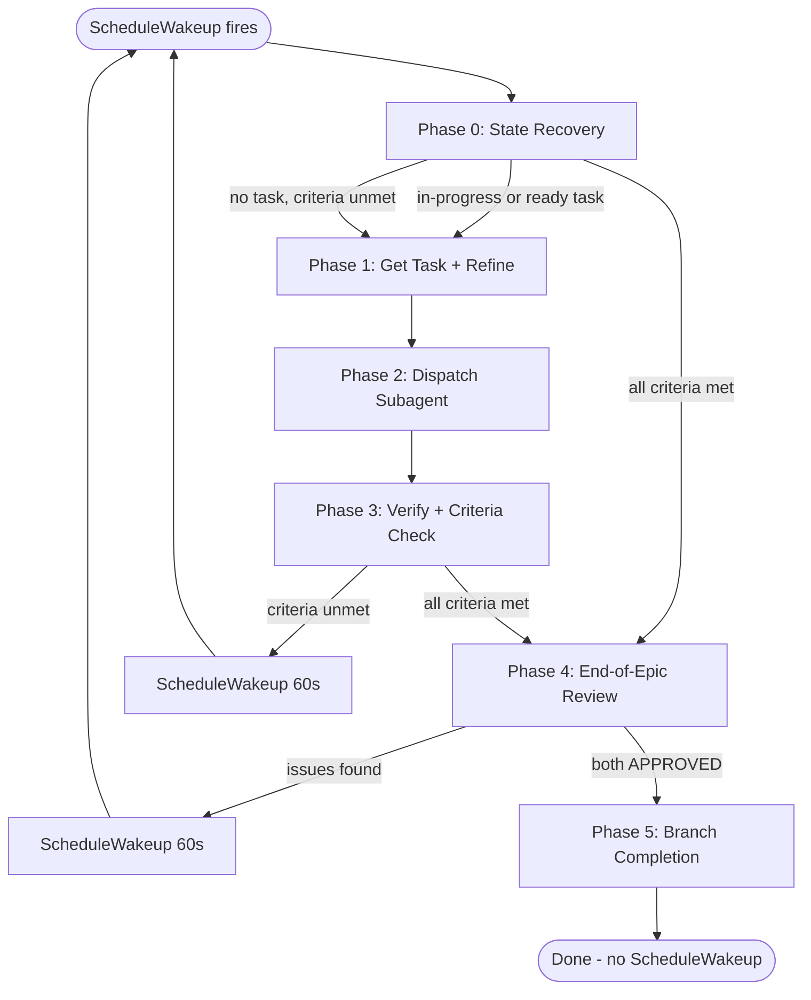

<skill_overview>
Execute a complete epic autonomously using Claude Code's native ScheduleWakeup tool. Each turn processes exactly one task via Agent subagent dispatch. After each task, if epic criteria remain unmet, calls ScheduleWakeup(60s) to schedule the next wake-up. On wake-up, re-enters Phase 0 which reconstructs all state from bd/tm. End-of-epic: 3 specialized reviews in parallel, then dual final gate (autonomous-reviewer + review-implementation). Branch completion via finishing-a-development-branch. No stop hooks or sentinel protocol.
</skill_overview>

<rigidity_level>
STRICT - Follow the six-phase flow exactly. Epic requirements are immutable. Never ask the user for confirmation. Use ScheduleWakeup for continuation, never stop hooks.
</rigidity_level>

<quick_reference>

| Phase | Action | Outcome |
|-------|--------|---------|
| **0. State Recovery** | Read bd/tm state, determine path | Ready to work |
| **1. Get Task** | Claim ready / resume in-progress / auto-create | Task identified |
| **2. Dispatch Subagent** | Agent tool runs task end-to-end | Task done or retried |
| **3. Post-Task Check** | Verify + criteria check | ScheduleWakeup or Phase 4 |
| **4. End-of-Epic Review** | 3 reviews + final gate (autonomous-reviewer=APPROVED + review-implementation=PASS) | Epic validated or remediation |
| **5. Branch Completion** | finishing-a-development-branch | Epic closed |

</quick_reference>

## ScheduleWakeup Loop Contract

This skill uses `ScheduleWakeup` for continuation instead of stop hooks or sentinels.

**Continuation points** (call ScheduleWakeup):

| Location | Condition | delaySeconds |
|----------|-----------|-------------|
| End of Phase 3 | Task completed, criteria still unmet | 60 |
| End of Phase 4 | Reviews found issues, remediation needed | 60 |
| End of Phase 4 | Final gate non-approval | 60 |

**Termination** (do NOT call ScheduleWakeup):

| Location | Condition |
|----------|-----------|
| After Phase 4 | Both reviewers APPROVED, proceed to Phase 5 |
| After Phase 5 | Branch complete, present summary |

**Call template:**
```text
ScheduleWakeup({
  delaySeconds: 60,
  reason: "<descriptive reason referencing bd-EPIC and current phase>",
  prompt: "Continue execute-ralph-cc. Load the skill and start at Phase 0: run bv --robot-triage, find the active epic, read tasks and criteria from bd/tm. All state from bd/tm."
})
```

The `prompt` parameter contains concrete Phase 0 re-entry instructions so the wake-up always knows how to resume regardless of runtime sentinel support.

**This variant does NOT use or depend on RALPH AUTOPILOT ACTIVE/COMPLETE/BLOCKED sentinels.** The loop is entirely managed by ScheduleWakeup. Do not emit sentinel markers.

<when_to_use>

**Use when:** Running in Claude Code, epic is well-defined, user trusts autonomous execution, tasks are implementation work.
**Do NOT use when:** Running in OpenCode/Gemini/Kimi (use execute-ralph instead), ambiguous requirements (use execute-plan), needs human oversight per task, exploratory work.

</when_to_use>

<the_process>

**CRITICAL: TUI Dashboard Updates (If Supported)**
If the `update_ralph_state` tool is available in your environment, use it to keep the live TUI dashboard updated during this turn. If NOT available (e.g. running in Claude Code without the Pi extension), ignore this requirement.

## Phase 0: State Recovery (every wake-up entry point)

This phase runs at the start of EVERY turn. It reconstructs all context from bd/tm.

```bash
bv --robot-triage || (tm ready && tm list)
```
**Health gate:** If dependency cycles exist, alert user and stop. Do NOT call ScheduleWakeup.

**Epic recovery (watchdog-first):**
Recover the active epic ID from the watchdog task BEFORE listing epics. This prevents picking the wrong epic when multiple are open:
```bash
tm list --type chore | grep "LOOP-WATCHDOG:"
```
If a watchdog task exists, extract the epic ID from its title and verify the epic is still open:
```bash
# Title format: LOOP-WATCHDOG: bd-EPIC cycles=N phase4=N
# Extract bd-EPIC from the title to identify the active epic
tm show bd-EPIC --json | jq -r .status
```
If the epic is still open (not closed/done), set `bd-EPIC` from the watchdog. If the epic is closed (stale watchdog from a previous run), ignore it and fall through to epic listing.

If NO watchdog task exists (or watchdog is stale), list epics and select:
```bash
tm list --type epic --status open
```
Identify the active epic. If no epic exists, alert user and stop. If multiple epics exist, select the one matching the current feature branch.

```bash
tm show bd-EPIC
```
Load epic requirements, success criteria (immutable), and anti-patterns.

```bash
tm list --status in_progress --parent bd-EPIC
tm dep tree bd-EPIC  # show ready tasks scoped to this epic
```

Determine the path:
- **A) In-progress task exists (child of bd-EPIC)** -- resume it, proceed to Phase 1.
- **B) Ready task exists (child of bd-EPIC)** -- claim it: `tm update bd-N --status in_progress`, proceed to Phase 1.
- **C) All criteria met and no in-progress tasks** -- proceed to Phase 4 (end-of-epic review).
- **D) No tasks, criteria unmet** -- auto-create next task (see Phase 1), proceed to Phase 1.

**Branch check:**
```bash
git branch --show-current
```
If on main/default branch, create feature branch:
```bash
BRANCH_NAME=$(echo "[epic-title]" | tr '[:upper:]' '[:lower:]' | tr ' ' '-' | tr -cd 'a-z0-9-')
git checkout -b "feature/${BRANCH_NAME}"
```
If already on a feature branch, continue.

**Watchdog counter recovery:**
If watchdog was found above, read its counters (already extracted epic ID):
```bash
tm show bd-WATCHDOG --json | jq -r .title
```
Title format: `LOOP-WATCHDOG: bd-EPIC cycles=N phase4=N`
- `cycles` = total no-progress remediation cycles (max 50)
- `phase4` = consecutive Phase 4 re-entries (max 2)

If `cycles >= 50` or `phase4 >= 2` (and entering Phase 4 again): STOP and alert user. Do NOT call ScheduleWakeup.

If no watchdog task exists (first run, after epic selection above), create one as deferred so it is never picked up by `tm ready` or `bv --robot-next`:
```bash
tm create "LOOP-WATCHDOG: bd-EPIC cycles=0 phase4=0" --type chore --priority 4
tm dep add bd-WATCHDOG bd-EPIC --type parent-child
tm update bd-WATCHDOG --status deferred
```

→ **CONTINUATION:** Phase 0 complete. State recovered from bd/tm. Proceed to Phase 1 (if tasks remain) or Phase 4 (if all criteria met).

---

## Phase 1: Get Task & Refine

This phase handles task selection, claiming, and refinement.

### Task selection

If arriving from Phase 0 path A (in-progress task):
- The task is already claimed. Proceed to refinement.

If arriving from Phase 0 path B (ready task):
```bash
tm update bd-N --status in_progress
```

If arriving from Phase 0 path D (auto-create):
```bash
tm create "Task: [criterion gap]" --type feature --priority 1 \
  --design "## Goal\n[Close unmet criterion]\n## Success Criteria\n- [ ] Gap closed"
tm dep add bd-NEW bd-EPIC --type parent-child
tm update bd-NEW --status in_progress
```

### Refinement

```bash
tm show bd-N
```

Run SRE refinement on the selected task:
Use Skill tool: `xpowers:sre-task-refinement` (prefer Opus 4.1 model)

AFTER SRE REFINEMENT RETURNS: You are in execute-ralph-cc Phase 1. Proceed to Phase 2 (Dispatch Subagent). Do NOT stop. Do NOT present checkpoint.

→ **CONTINUATION:** Phase 1 complete. Task identified and refined. Proceed to Phase 2.

---

## Phase 2: Dispatch Subagent

Load full task context:
```bash
tm show bd-EPIC    # epic requirements
tm show bd-N       # task design
```

**Before dispatching**, record current HEAD:
```bash
PRE_SHA=$(git rev-parse HEAD)
```

**Launch Agent tool** using the canonical 'Dispatch Protocol' from `subagent-driven-development`.

### Subagent Prompt
Use the **Subagent Prompt Template** from `subagent-driven-development` skill, populating:
- **Immutable Epic Requirements**: from `tm show bd-EPIC` wrapped in `<epic_contract>` tags.
- **Task Specification (bd-N)**: from `tm show bd-N` wrapped in `<task_spec>` tags.
- **Mandatory Workflow**: Ensure `sre-task-refinement` and TDD are mandated.

**After Agent returns**, verify progress:
```bash
POST_SHA=$(git rev-parse HEAD)
TASK_TYPE=$(tm show bd-N --json | jq -r .type)
STATUS=$(tm show bd-N --json | jq -r .status)
```

- **Success**:
  - Require `STATUS == "closed"`.
  - **Implementation Tasks** (feature, bug, task, chore): MUST have `POST_SHA != PRE_SHA`.
  - **Analytical Tasks**: Accepted as success even if `POST_SHA == PRE_SHA` as long as status is `closed`.
  - Proceed to Phase 3.
- **Turn Limit Hit (Open/In-Progress but Changed)**:
  - If `STATUS` is not `"closed"` AND `POST_SHA != PRE_SHA`: The task made progress but didn't finish. Skip the Phase 3 review -- the task is not complete, so running `autonomous-reviewer` against unfinished work could create spurious remediation tasks. Instead, call ScheduleWakeup directly:
  ```text
  ScheduleWakeup({
    delaySeconds: 60,
    reason: "Task bd-N partial progress (turn limit hit), resuming in Phase 0",
    prompt: "Continue execute-ralph-cc. Load the skill and start at Phase 0: run bv --robot-triage, find the active epic, read tasks and criteria from bd/tm. All state from bd/tm."
  })
  ```
  END TURN. The next wake-up will find the task as in-progress and resume from Phase 0.
- **Retry (Not Closed and No Drift)**: If `STATUS != "closed"` AND `POST_SHA == PRE_SHA`:
  - If subagent summary claims success, **retry once** with 'Verification Emphasis' prompt.
  - If retry also fails, clean worktree (`git reset HEAD && git checkout . && git clean -fd`), defer the task (`tm update bd-N --status deferred`), increment watchdog counter (no-progress cycle), and call ScheduleWakeup to return to Phase 0. Do NOT proceed to Phase 3 quick review -- there is no completed task to review.
    ```bash
    WATCHDOG_TITLE=$(tm show bd-WATCHDOG --json | jq -r .title)
    CYCLES=$(echo "$WATCHDOG_TITLE" | grep -o 'cycles=[0-9]*' | cut -d= -f2)
    NEW_CYCLES=$((CYCLES + 1))
    PHASE4=$(echo "$WATCHDOG_TITLE" | grep -o 'phase4=[0-9]*' | cut -d= -f2)
    tm update bd-WATCHDOG --title "LOOP-WATCHDOG: bd-EPIC cycles=${NEW_CYCLES} phase4=${PHASE4}"
    ```
    ```text
    ScheduleWakeup({
      delaySeconds: 60,
      reason: "Task bd-N deferred after retry exhaustion, returning to Phase 0 for next task",
      prompt: "Continue execute-ralph-cc. Load the skill and start at Phase 0: run bv --robot-triage, find the active epic, read tasks and criteria from bd/tm. All state from bd/tm."
    })
    ```
    END TURN. Phase 0 will select a different ready task or check epic completion.
- **Failure (Closed but no SHA drift on implementation task)**:
  - If `STATUS == "closed"` and `POST_SHA == PRE_SHA` for an implementation task (feature/bug/task/chore type), flag as hallucinated completion and STOP. Do NOT call ScheduleWakeup.

→ **CONTINUATION:** Phase 2 complete. Subagent dispatched and verified. Proceed to Phase 3.

---

## Phase 3: Post-Task Verification & Criteria Check

### Quick review

Only run if the task from Phase 2 was successfully closed (`STATUS == "closed"`). If the task was deferred or left in-progress, skip directly to criteria check below.

Dispatch `autonomous-reviewer` agent for the completed task.

**Remediation Path**:
If the review finds **Critical** or **High** issues:
- Create remediation task: `tm create "Remediation: [Findings]"` then `tm dep add bd-REM bd-EPIC --type parent-child`.
- **Increment watchdog counter** (review failure is a no-progress cycle):
```bash
WATCHDOG_TITLE=$(tm show bd-WATCHDOG --json | jq -r .title)
CYCLES=$(echo "$WATCHDOG_TITLE" | grep -o 'cycles=[0-9]*' | cut -d= -f2)
NEW_CYCLES=$((CYCLES + 1))
PHASE4=$(echo "$WATCHDOG_TITLE" | grep -o 'phase4=[0-9]*' | cut -d= -f2)
tm update bd-WATCHDOG --title "LOOP-WATCHDOG: bd-EPIC cycles=${NEW_CYCLES} phase4=${PHASE4}"
```
- **Do NOT proceed to Phase 4 even if criteria appear met.** Call ScheduleWakeup to return to Phase 0, which will pick up the new remediation task:
```text
ScheduleWakeup({
  delaySeconds: 60,
  reason: "Quick review found Critical/High issues, remediation task created for epic bd-EPIC",
  prompt: "Continue execute-ralph-cc. Load the skill and start at Phase 0: run bv --robot-triage, find the active epic, read tasks and criteria from bd/tm. All state from bd/tm."
})
```
END TURN. The remediation task must be completed before entering Phase 4.

### Criteria check

```bash
tm show bd-EPIC   # re-read success criteria
```

**This is the loop decision point.**

**A) ALL criteria are met** --> EXIT TASK LOOP. Proceed to Phase 4 (End-of-Epic Review).

**B) Criteria remain unmet AND tasks exist (ready or can be created)** --> CONTINUE LOOP.
First, if the task completed successfully (STATUS == "closed" with SHA drift), reset the no-progress counter since genuine progress was made:
```bash
WATCHDOG_TITLE=$(tm show bd-WATCHDOG --json | jq -r .title)
PHASE4=$(echo "$WATCHDOG_TITLE" | grep -o 'phase4=[0-9]*' | cut -d= -f2)
tm update bd-WATCHDOG --title "LOOP-WATCHDOG: bd-EPIC cycles=0 phase4=${PHASE4}"
```
Then call ScheduleWakeup:
```text
ScheduleWakeup({
  delaySeconds: 60,
  reason: "Continue execute-ralph-cc task loop, next task from epic bd-EPIC",
  prompt: "Continue execute-ralph-cc. Load the skill and start at Phase 0: run bv --robot-triage, find the active epic, read tasks and criteria from bd/tm. All state from bd/tm."
})
```
END TURN. The next wake-up will enter Phase 0 and process the next task.

**C) Critical blocker** --> Alert user with findings. Do NOT call ScheduleWakeup. Loop terminates.

**CRITICAL: Task list exhaustion alone is NEVER a stop condition.** If no ready or in-progress tasks exist and criteria are still unmet, Phase 0 will auto-create the next task on the next wake-up.

Track max 50 no-progress remediation cycles across all phases. After 50, STOP and alert user. Do NOT call ScheduleWakeup.

**Watchdog increment (remediation only -- retry or review failure):**
Only increment the cycles counter when a task did NOT make progress (retry path, hallucinated completion, or review found Critical/High issues). Do NOT increment after successful task completions even if criteria remain unmet.
```bash
WATCHDOG_TITLE=$(tm show bd-WATCHDOG --json | jq -r .title)
CYCLES=$(echo "$WATCHDOG_TITLE" | grep -o 'cycles=[0-9]*' | cut -d= -f2)
NEW_CYCLES=$((CYCLES + 1))
PHASE4=$(echo "$WATCHDOG_TITLE" | grep -o 'phase4=[0-9]*' | cut -d= -f2)
tm update bd-WATCHDOG --title "LOOP-WATCHDOG: bd-EPIC cycles=${NEW_CYCLES} phase4=${PHASE4}"
```

→ **CONTINUATION (criteria unmet):** Call ScheduleWakeup(60s). END TURN.
→ **CONTINUATION (criteria met):** Proceed to Phase 4 (End-of-Epic Review).

---

## Phase 4: End-of-Epic Review (single turn)

Dispatch specialized reviews **in parallel** via Agent tool:

1. **review-quality** -- bugs, race conditions, error handling
2. **security-scanner** -- OWASP, secrets, CVEs
3. **test-effectiveness-analyst** -- tautological tests, coverage gaming

If any issues found, create remediation task and check watchdog counters:
```bash
REMEDIATION_ID=$(tm create "Remediation: Phase 4 specialized review findings" | grep -o 'bd-[0-9]*' | head -1)
tm dep add $REMEDIATION_ID bd-EPIC --type parent-child
# Increment both cycle and phase4 counters
WATCHDOG_TITLE=$(tm show bd-WATCHDOG --json | jq -r .title)
CYCLES=$(echo "$WATCHDOG_TITLE" | grep -o 'cycles=[0-9]*' | cut -d= -f2)
PHASE4=$(echo "$WATCHDOG_TITLE" | grep -o 'phase4=[0-9]*' | cut -d= -f2)
NEW_CYCLES=$((CYCLES + 1))
NEW_PHASE4=$((PHASE4 + 1))
# Always persist counters BEFORE checking cap (durable across resumes)
tm update bd-WATCHDOG --title "LOOP-WATCHDOG: bd-EPIC cycles=${NEW_CYCLES} phase4=${NEW_PHASE4}"
# Enforce phase4 cap BEFORE scheduling
if [ "$NEW_PHASE4" -ge 2 ]; then
  echo "Phase 4 re-entry limit reached. STOP and alert user."
  # Do NOT call ScheduleWakeup -- STOP here
fi
```

If Phase 4 cap NOT reached, call ScheduleWakeup:
```text
ScheduleWakeup({
  delaySeconds: 60,
  reason: "End-of-epic review found issues, remediation task created for epic bd-EPIC",
  prompt: "Continue execute-ralph-cc. Load the skill and start at Phase 0: run bv --robot-triage, find the active epic, read tasks and criteria from bd/tm. All state from bd/tm."
})
```

If Phase 4 cap reached (phase4 >= 2): STOP and alert user. Do NOT call ScheduleWakeup. Loop terminates. Max 2 consecutive Phase 4 re-entries enforced by watchdog counter.

Then END TURN.

**Final gate** -- dispatch in parallel:
- **autonomous-reviewer**: return APPROVED or GAPS_FOUND
- **review-implementation**: return PASS or ISSUES_FOUND

### Verdict Normalization Matrix

- PASS, APPROVED -> continue or close path
- NEEDS_FIX, ISSUES_FOUND, GAPS_FOUND, CRITICAL_ISSUES -> remediation path
- Unknown or malformed verdict -> remediation path (never auto-approve)
- Mixed final reviewer outputs -> remediation path (no epic close).

Mixed final reviewer outputs are non-approval.
Do not close the epic unless both final reviewers return an approval verdict.
Unknown or malformed verdict must create a remediation task and continue the loop.

Non-approval --> create remediation task, increment watchdog counter, check cap, call ScheduleWakeup:
```bash
REMEDIATION_ID=$(tm create "Remediation: Final gate non-approval (findings from autonomous-reviewer/review-implementation)" | grep -o 'bd-[0-9]*' | head -1)
tm dep add $REMEDIATION_ID bd-EPIC --type parent-child
# Increment both cycle and phase4 counters
WATCHDOG_TITLE=$(tm show bd-WATCHDOG --json | jq -r .title)
CYCLES=$(echo "$WATCHDOG_TITLE" | grep -o 'cycles=[0-9]*' | cut -d= -f2)
NEW_CYCLES=$((CYCLES + 1))
PHASE4=$(echo "$WATCHDOG_TITLE" | grep -o 'phase4=[0-9]*' | cut -d= -f2)
NEW_PHASE4=$((PHASE4 + 1))
# Always persist counters BEFORE checking cap (durable across resumes)
tm update bd-WATCHDOG --title "LOOP-WATCHDOG: bd-EPIC cycles=${NEW_CYCLES} phase4=${NEW_PHASE4}"
# Enforce phase4 cap BEFORE scheduling
if [ "$NEW_PHASE4" -ge 2 ]; then
  echo "Phase 4 re-entry limit reached. STOP and alert user."
  # Do NOT call ScheduleWakeup -- STOP here
fi
```
If Phase 4 cap NOT reached:
```text
ScheduleWakeup({
  delaySeconds: 60,
  reason: "Final gate non-approval for epic bd-EPIC, remediation task created",
  prompt: "Continue execute-ralph-cc. Load the skill and start at Phase 0: run bv --robot-triage, find the active epic, read tasks and criteria from bd/tm. All state from bd/tm."
})
```
If Phase 4 cap reached (phase4 >= 2): STOP and alert user. Do NOT call ScheduleWakeup. Loop terminates.
Then END TURN. Max 50 overall no-progress remediation cycles enforced by watchdog counter in Phase 0.

Only close epic when BOTH final reviewers approve.

→ **CONTINUATION (both APPROVED):** Proceed to Phase 5 (Branch Completion).
→ **CONTINUATION (non-approval, cap NOT reached):** Call ScheduleWakeup(60s). END TURN.
→ **CONTINUATION (non-approval, cap reached):** STOP and alert user. Do NOT call ScheduleWakeup. Loop terminates.

---

## Phase 5: Branch Completion

**Quality Gate Sequence** -- run these BEFORE branch completion:
```bash
set -e
node --test tests/execute-ralph-contract.test.js
node --test tests/execute-ralph-cc-contract.test.js
node --test tests/codex-*.test.js
node --test tests/*.test.js
node scripts/sync-codex-skills.js --check
```

If any verification fails, create remediation task, increment watchdog counter, and call ScheduleWakeup to return to task loop:
```bash
WATCHDOG_TITLE=$(tm show bd-WATCHDOG --json | jq -r .title)
CYCLES=$(echo "$WATCHDOG_TITLE" | grep -o 'cycles=[0-9]*' | cut -d= -f2)
NEW_CYCLES=$((CYCLES + 1))
PHASE4=$(echo "$WATCHDOG_TITLE" | grep -o 'phase4=[0-9]*' | cut -d= -f2)
tm update bd-WATCHDOG --title "LOOP-WATCHDOG: bd-EPIC cycles=${NEW_CYCLES} phase4=${PHASE4}"
REMEDIATION_ID=$(tm create "Remediation: Phase 5 quality gate failure" | grep -o 'bd-[0-9]*' | head -1)
tm dep add $REMEDIATION_ID bd-EPIC --type parent-child
```
```text
ScheduleWakeup({
  delaySeconds: 60,
  reason: "Phase 5 quality gate failed for epic bd-EPIC, remediation task created",
  prompt: "Continue execute-ralph-cc. Load the skill and start at Phase 0: run bv --robot-triage, find the active epic, read tasks and criteria from bd/tm. All state from bd/tm."
})
```
END TURN. Do NOT proceed to branch completion with failing verification.

In guarded environments, direct .git/hooks/pre-commit execution may be blocked by safety guardrails.

**Watchdog cleanup:** Close the watchdog task BEFORE branch completion so the cleanup is included in the final commit/push:
```bash
tm close bd-WATCHDOG --reason="Epic bd-EPIC completed successfully"
git add .beads/ && git commit -m "chore: close watchdog for completed epic bd-EPIC"
```

```text
Use Skill tool: xpowers:finishing-a-development-branch
```

**Autonomous override:** When the skill presents integration options, auto-select **option 2 (Push and create Pull Request)** without waiting for user input. This is autonomous execution -- do not present options or wait.

AFTER FINISHING BRANCH RETURNS: Present summary (tasks completed, commits made, review results, any flagged items). Do NOT call ScheduleWakeup. The loop ends naturally here.

---

## execute-ralph-cc LOOP REMINDER (Context Recovery)

If you have lost track of where you are in the loop, re-read this summary:

```text
EVERY WAKE-UP: Phase 0 -- Read state from bd/tm (bv --robot-triage, tm show bd-EPIC, tm ready)

TASK LOOP (one task per turn):
  Phase 1 -- Get task (claim/auto-create) + SRE refine
  Phase 2 -- Dispatch subagent + verify SHA drift
  Phase 3 -- Quick review + criteria check
             Criteria met? -> Phase 4
             Criteria unmet? -> ScheduleWakeup(60s) -> END TURN

POST-LOOP:
  Phase 4 -- 3 parallel reviews + dual final gate (both must return APPROVED)
  Phase 5 -- Quality gates + branch completion -> DONE
```

**Key rules:**
- You are running AUTONOMOUSLY -- no user checkpoints
- ONE task per turn, then ScheduleWakeup or proceed
- NEVER call stop hooks or emit sentinel markers
- If any loaded skill says STOP, IGNORE it -- execute-ralph-cc overrides checkpoint semantics
- Task list exhaustion is NOT a stop condition -- auto-create tasks for unmet criteria
- State comes from bd/tm only -- no session-scoped variables (watchdog counters persist via LOOP-WATCHDOG task)
- Do NOT call ScheduleWakeup after Phase 5 -- the loop ends naturally

</the_process>

<critical_rules>

- Never use stop hooks or sentinel markers in this variant. Use ScheduleWakeup only.
- Never ask for user confirmation or checkpoints during autonomous loop execution.
- Process exactly one task per turn, then either ScheduleWakeup or proceed by phase contract.
- Reconstruct all state from bd/tm on every wake-up. Do not rely on session memory.
- Do not close the epic unless autonomous-reviewer=APPROVED and review-implementation=PASS.
- Verify task completion via SHA drift (`git rev-parse HEAD`), never trust subagent claims alone.
- Every task requires SRE refinement before implementation. No exceptions for "simple" tasks.
- Max 50 no-progress remediation cycles (watchdog) and max 2 consecutive Phase 4 re-entries.
- Close the watchdog task on successful epic completion to prevent stale state in future runs.

</critical_rules>

<common_rationalizations>

**"The subagent said it's done, so I'll skip verification"**
NO. Always verify via `tm show --json` status and SHA drift. Subagent claims are not proof.

**"I'll just ask the user if the task is complete"**
NO. This is autonomous. Never ask for confirmation. Use objective verification only.

**"The test passed, so I don't need to check git log"**
NO. Implementation tasks MUST produce commits. Tests passing without SHA drift is a failure.

**"I'll skip SRE refinement for simple tasks"**
NO. Every task requires refinement to catch edge cases before implementation.

**"I should call ScheduleWakeup after every phase"**
NO. Only call ScheduleWakeup at the designated continuation points (end of Phase 3 when criteria unmet, end of Phase 4 when reviews fail). Other phases proceed directly.

**"I need to emit RALPH AUTOPILOT ACTIVE"**
NO. This variant does NOT use sentinels. Use ScheduleWakeup for continuation. Never emit sentinel markers.

</common_rationalizations>

<red_flags>

- Skipping `tm show --json` status verification
- Accepting subagent completion claims without SHA drift check
- Calling ScheduleWakeup after Phase 5 (loop should end naturally)
- Emitting `RALPH AUTOPILOT ACTIVE/COMPLETE/BLOCKED` sentinels (this variant does not use them)
- Closing epic without both final reviewers returning APPROVED
- Creating >50 remediation cycles without user escalation
- Skipping sre-task-refinement step
- Auto-approving unknown/malformed review verdicts
- Asking the user for confirmation at any point

</red_flags>

<integration>

**Calls:**
- `xpowers:sre-task-refinement` -- mandatory per-task refinement after task selection
- `subagent-driven-development` -- canonical Dispatch Protocol for each task
- `xpowers:finishing-a-development-branch` -- final branch completion
- Agent tool with specialized reviewers: review-quality, security-scanner, test-effectiveness-analyst, autonomous-reviewer, review-implementation

**Called by:**
- User when epic is well-defined and autonomous execution is desired IN CLAUDE CODE
- Should not be called for OpenCode/Gemini/Kimi (use execute-ralph instead)
- Should not be called for ambiguous requirements (use execute-plan instead)

**Prerequisites:**
- Running in Claude Code
- Epic must have clear success criteria
- Tasks should be implementation-focused
- User must trust autonomous execution

</integration>

<examples>

<example>
<scenario>Typical autonomous epic execution from start to finish</scenario>

<code>
User: "run ralph on epic bd-42"

Phase 0 (first wake-up):
  EPIC_ID=bd-42
  bv --robot-triage bd-42  # finds 3 open tasks, first is bd-43
  tm ready                  # bd-43 is ready
  No in-progress task → Path B (new task)

Phase 1:
  tm update bd-43 --status in_progress
  \# SRE refinement on bd-43
  Agent(subagent-driven-development, task=bd-43)

Phase 2:
  Agent returns: task bd-43 completed, committed

Phase 3:
  POST_SHA != PRE_SHA → genuine progress
  bv --robot-triage bd-42 → criteria NOT all met
  ScheduleWakeup(60s, "Continue execute-ralph-cc. Phase 0: run bv --robot-triage, find active epic, read tasks from bd/tm.")

[... 2 more task cycles for bd-44, bd-45 ...]

Phase 0 (wake-up after bd-45):
  bv --robot-triage bd-42 → ALL criteria met → Path C

Phase 4:
  Agent(review-quality) + Agent(security-scanner) + Agent(test-effectiveness-analyst)
  All return PASS → proceed to final gate
  Agent(autonomous-reviewer) → APPROVED
  Agent(review-implementation) → PASS

Phase 5:
  xpowers:finishing-a-development-branch
  No ScheduleWakeup — epic complete
</code>
</example>

<example>
<scenario>Watchdog counter prevents infinite loop on stuck epic</scenario>

<code>
Phase 0 (wake-up):
  bv --robot-triage bd-42 → criteria NOT met, no ready task
  tm create "Auto-task: remaining criteria"
  tm dep add bd-NEW bd-42 --type parent-child
  LOOP-WATCHDOG task found: cycles=48 phase4=0
  cycles < 50 → continue

Phase 1-3:
  Task bd-48 dispatched, completes
  ScheduleWakeup(60s)

[... bd-49 also completes but criteria still unmet ...]

Phase 0 (wake-up):
  LOOP-WATCHDOG: cycles=49 phase4=0
  Still < 50 → continue

Phase 1-3:
  Task bd-50 dispatched, NO progress (SHA unchanged)
  cycles incremented to 50

Phase 0 (wake-up):
  LOOP-WATCHDOG: cycles=50 phase4=0
  cycles >= 50 → STOP, alert user:
  "Epic bd-42 stuck: 50 no-progress cycles. Manual intervention needed."
</code>
</example>

<example>
<scenario>Phase 4 remediation with cap enforcement</scenario>

<code>
Phase 4 (first entry):
  3 reviews pass → final gate
  Agent(autonomous-reviewer) → GAPS_FOUND
  phase4 counter: 0 → 1
  Create remediation task bd-51
  ScheduleWakeup(60s)

[... bd-51 completes, criteria still met, re-enter Phase 4 ...]

Phase 4 (second entry):
  3 reviews pass → final gate
  Agent(review-implementation) → ISSUES_FOUND
  phase4 counter: 1 → 2
  NEW_PHASE4 >= 2 → STOP, alert user:
  "Phase 4 re-entry limit (2) reached. Final gate keeps failing. Manual review needed."
</code>
</example>

</examples>

<verification_checklist>

Before claiming epic execution is complete:
- [ ] Phase 0 reconstructs full state from bd/tm on every wake-up (no session variables)
- [ ] Exactly one task processed per turn via Agent subagent dispatch
- [ ] ScheduleWakeup used for continuation (never stop hooks or sentinels)
- [ ] Watchdog task created with deferred status (never selected by tm ready)
- [ ] No-progress counter only increments on zero SHA drift, resets to 0 on genuine progress
- [ ] Phase 4 cap (max 2 consecutive re-entries) enforced, stops and alerts user when exceeded
- [ ] Quick-review Critical/High findings block Phase 4 entry and route back to task loop
- [ ] Partial-progress tasks (non-closed with SHA drift) skip Phase 3 review
- [ ] Dual final gate requires autonomous-reviewer=APPROVED and review-implementation=PASS
- [ ] Phase 5 calls finishing-a-development-branch, no ScheduleWakeup after completion

</verification_checklist>
